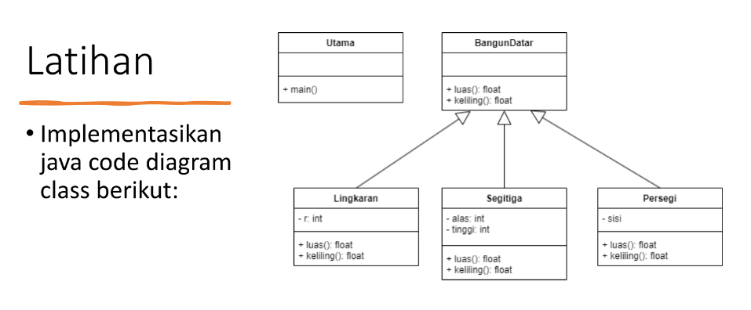
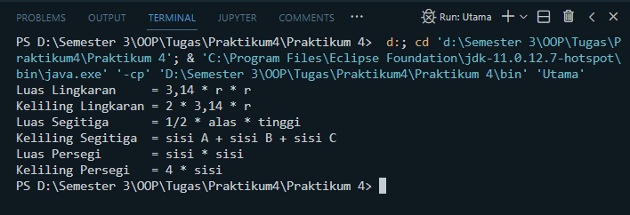

# <p align= center> **Praktikum 4**
```sh
Nama    : Achmad Mahfud
NIM     : 312110520
Matkul  : Pemrograman Berorientasi Objek
Kelas   : TI.21.C5
```
## <p align= center>**Tugas Latihan**


## <p align= center>**Program**
### BangunDatar
```sh
public class BangunDatar {
    public float luas;
    public float keliling;

    public void luas() {
        System.out.println("Luas Bangun Datar");
    }
    public void keliling() {
        System.out.println("Keliling Bangun Datar");
    }

}
```
### Lingkaran
```sh
public class Lingkaran {
    private int r;

    public void setR(int r) {
        this.r = r;
    }
    public int getR() {
        return r;
    }
    
    public float luas;
    public float keliling;

    public void luas(){
        System.out.println("Luas Lingkaran     = 3,14 * r * r");
    }
    public void keliling(){
        System.out.println("Keliling Lingkaran = 2 * 3,14 * r");
    }
}
```
### Segitiga
```sh
public class Segitiga extends BangunDatar {
    private int alas;
    private int tinggi;

    public void setAlas(int alas) {
        this.alas = alas;
    }
    public int getAlas() {
        return alas;
    }
    public void setTinggi(int tinggi) {
        this.tinggi = tinggi;
    }
    public int getTinggi() {
        return tinggi;
    }
    public void luas(){
        System.out.println("Luas Segitiga      = 1/2 * alas * tinggi");
    }
    public void keliling(){
        System.out.println("Keliling Segitiga  = sisi A + sisi B + sisi C");
    }
}
```
### Persegi
```sh
public class Persegi extends BangunDatar {
    private int sisi;
    public void setSisi(int sisi) {
        this.sisi = sisi;
    }
    public int getSisi() {
        return sisi;
    }

    public void luas(){
        System.out.println("Luas Persegi       = sisi * sisi");
    }
    public void keliling(){
        System.out.println("Keliling Persegi   = 4 * sisi");
    }
}
```
### Utama
```sh
public class Utama {
    public static void main(String[] args){
        Lingkaran lingkaran = new Lingkaran();
        Segitiga segitiga = new Segitiga();
        Persegi persegi = new Persegi();

        lingkaran.luas();
        lingkaran.keliling();
        segitiga.luas();
        segitiga.keliling();
        persegi.luas();
        persegi.keliling();
    }
}
```
## <p align= center>**Output Program**

